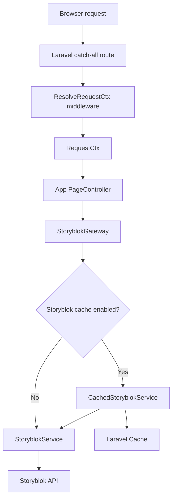
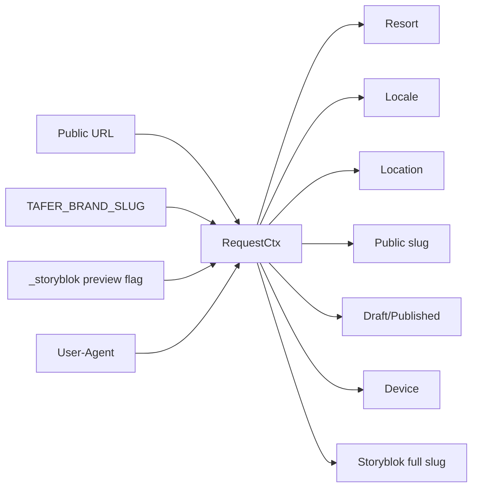
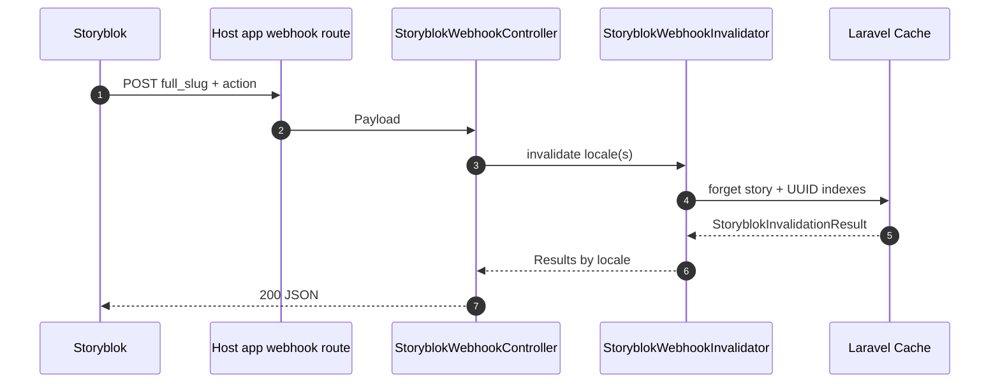

# TAFER Laravel Platform  🐙

Shared logic for TAFER Laravel projects.

---

## Storyblok

See [Storyblok cache architecture](docs/storyblok-cache.md) for the full cache
flow, request-context behavior, webhook invalidation, and extension points.

### How host projects use it

Consumer apps should keep app-specific configuration in the host project and use
this package for the shared Storyblok/request logic.



The app controller should only ask the resolved request context for the
Storyblok slug and request options:

```php
use Illuminate\Http\JsonResponse;
use TAFER\Core\Context\RequestCtx;
use TAFER\Core\Contracts\StoryblokGateway;
use TAFER\Core\Storyblok\StoryblokRequestFactory;

final readonly class PageController
{
    public function __construct(
        private StoryblokGateway $storyblok,
        private StoryblokRequestFactory $requests,
    ) {}

    public function __invoke(RequestCtx $context): JsonResponse
    {
        $response = $this->storyblok->getStory(
            $context->storyblokSlug(),
            $context->storyblokRequest($this->requests),
        );

        return response()->json($response->story);
    }
}
```

Register the shared request-context middleware on the catch-all route:

```php
use Illuminate\Support\Facades\Route;
use App\Http\Controllers\PageController;
use TAFER\Core\Middlewares\ResolveRequestCtx;

Route::get('/{slug?}', PageController::class)
    ->where('slug', '.*')
    ->middleware(ResolveRequestCtx::class);
```

`RequestCtx` centralizes the common request data:



Examples:

| Host URL | Brand | Storyblok slug |
|---|---|---|
| `/` | `villa-palmar-cancun` | `brands/villa-palmar-cancun/home-villa-palmar-cancun` |
| `/home-villa-palmar-cancun` | `villa-palmar-cancun` | `brands/villa-palmar-cancun/home-villa-palmar-cancun` |
| `/puerto-vallarta` | `garza-blanca` | `brands/garza-blanca/puerto-vallarta/home-puerto-vallarta` |
| `/es/puerto-vallarta/suites` | `mousai` | `brands/mousai/puerto-vallarta/suites` |

### Host project configuration

Publish the config into each host app:

```bash
php artisan vendor:publish --tag=tafer-config
```

Then override the values in the host app's published `config/tafer.php`:

```php
return [
    'brand' => [
        'slug' => 'villa-palmar-cancun',
    ],

    'middleware' => [
        'base_url' => 'https://middleware.taferresorts.com/',
    ],

    'storyblok' => [
        'token' => env('STORYBLOK_TOKEN'),
        'version' => 'published',
        'default_locale' => 'en',
        'resolve_links' => 'url',
        'global_config' => [
            // Set false for resorts such as Villa Palmar whose configuration
            // always lives at brands/{resort}/config_brand.
            'location_scoped' => false,
        ],

        'cache' => [
            'enabled' => true,
            'store' => 'database',
            'story_ttl' => 0,
            'relation_ttl' => 0,
            'prefix' => 'tafer:storyblok',
            'namespace' => 'villa-palmar-cancun',
        ],
    ],
];
```

The package config ships with the common non-sensitive defaults used by TAFER
apps. Each app should override its brand/cache namespace and decide whether its
published config uses fixed values or reads from that app's `.env`.

Required values fail early with a clear exception when their dependent service is
resolved:

- `tafer.brand.slug`, required by `RequestCtx`.
- `tafer.middleware.base_url`, required by the reviews middleware client.
- `tafer.storyblok.token`, required by the Storyblok API client.

Set `STORYBLOK_CACHE_ENABLED=false` to use the raw `StoryblokService` without
the cache decorator if your app config maps that value from `.env`; otherwise set
`'storyblok.cache.enabled' => false` directly in the host config.

### Webhook invalidation

Host apps can reuse the package controller directly:

```php
use Illuminate\Support\Facades\Route;
use TAFER\Core\Http\Controllers\StoryblokWebhookController;

Route::post('/storyblok/webhook', StoryblokWebhookController::class);
```

Because Storyblok posts from outside the Laravel session, exclude this route
from CSRF verification in the host app.



When Storyblok sends `full_slug__i18n__es`, the controller invalidates both
`en` and `es`. Without that field it invalidates only the locale inferred from
`full_slug`.

Example:

```bash
curl -X POST https://example.com/storyblok/webhook \
  -H "Content-Type: application/json" \
  -d '{"text":"The user published the Story Home","action":"published","space_id":285826016720786,"story_id":173251456956919,"full_slug":"brands/villa-palmar-cancun/home-villa-palmar-cancun","full_slug__i18n__es":"es/brands/villa-palmar-cancun/home-villa-palmar-cancun"}'
```

### Local workbench

Run the real Storyblok workbench:

```bash
composer serve
```

Configure the workbench environment and open the public slug. For example:

```dotenv
TAFER_BRAND_SLUG=villa-palmar-cancun
STORYBLOK_TOKEN=your_public_token
STORYBLOK_CACHE_ENABLED=true
```

Then open [http://localhost:6969/home-villa-palmar-cancun](http://localhost:6969/home-villa-palmar-cancun).
The workbench converts that public URL into the Storyblok slug
`brands/villa-palmar-cancun/home-villa-palmar-cancun` through `RequestCtx`.

The workbench webhook URL is:

```text
POST http://localhost:6969/storyblok/webhook
```

---

## Shared consumer logic

Version 0.4 centralizes the common implementation used by the TAFER Laravel
applications. Consumer projects should register these middleware explicitly in
their web middleware stack:

```php
use TAFER\Core\Middlewares\RedirectLegacyHomePrefix;
use TAFER\Core\Middlewares\ResolveRequestCtx;
use TAFER\Core\Middlewares\SetCacheHeaders;
```

The package also exposes:

- `TAFER\Core\Http\Controllers\DownloadController`
- `TAFER\Core\Services\BreadcrumbService`
- `TAFER\Core\Services\RecaptchaService`
- `TAFER\Core\Services\HubSpotMiddlewareService`
- `TAFER\Core\Storyblok\StoryblokComponentHelper`
- `TAFER\Core\Storyblok\StoryblokLinkResolver`
- `TAFER\Core\Storyblok\StoryblokRichTextHelper`
- `TAFER\Core\Storyblok\InlineHtmlSanitizer`
- `TAFER\Core\Storyblok\LoadsGlobalConfig`
- `TAFER\Core\Support\ConditionalOfferHelper`
- `TAFER\Core\View\Components\StoryblokResolver`, registered as
  `<x-storyblok._resolver>`

Host apps can register the shared legacy download controller directly while
keeping their existing route name:

```php
use Illuminate\Support\Facades\Route;
use TAFER\Core\Http\Controllers\DownloadController;

Route::get('/download/pdf', DownloadController::class)->name('download.pdf');
```

The downloader is intentionally centralized with its existing behavior in this
release. Its source contains security TODOs for arbitrary URL/stream access,
SSRF, redirects, timeouts, size limits, memory use, and exception disclosure.
Those controls must be implemented before treating it as a hardened proxy.

Consumer Storyblok adapters can expose global configuration without a separate
service class:

```php
use TAFER\Core\Storyblok\LoadsGlobalConfig;

class StoryblokService
{
    use LoadsGlobalConfig;

    // Existing getStory(...) implementation.
}

$globalConfig = $storyblokService->getGlobalConfig($requestCtx, $requestCtx->isPreview);
```

`RecaptchaService` continues reading `services.recaptcha.secret` and
`HubSpotMiddlewareService` continues reading
`services.middleware.hubspot_endpoint` and `services.middleware.mail_token`, so
existing host configuration remains compatible.

Legacy Blade calls such as `storyblokImage()`, `resolve_link()`,
`cleanStoryblokText()`, `getSvgContent()`, `customFilterImage()`,
`generateResponsiveSrcset()`, and `getImageDimensions()` are autoloaded by
the package. Their behavior follows the Villa Palmar implementation.

The migrated classes contain TODO markers because this release intentionally
centralizes the existing behavior before redesigning those APIs.

---

## Workflow & Releases

### Branch Strategy

#### `main`
Stable branch.  
Only production-ready code lives here.  
Every change here should be taggable.

#### `dev`
Integration branch.  
All features are merged here before becoming a release.

##### By Format
```sh
<type>/<short-description>
```

##### Common Types

- `feat` → New functionality
- `fix` → Bug fixes
- `chore` → Core/internal changes
- `refactor` → Refactor changes
- `docs` → Documentation changes
- `test` → Tests changes
Examples:

```bash
feat/resort-enums
feat/storyblok-integration
test/resort-enums
docs/readme-workflow
fix/location-label
refactor/resort-structure
chore/update-dependencies
```

## Development Flow

1. Create a feature branch
```bash
git checkout dev
git pull origin dev
git checkout -b feat/my-feature
```

2. Work locally
Run tests:
```bash
composer test
```

3. Open PR -> `dev`
```bash
feat/my-feature -> dev
```
requirements:
- Tests passing (CI)
- Code review approved
- No conflicts

4. Merge into dev
Once approved, merge the PR.

## Release Flow

5. Open PR from `dev` to `main`
```sh
dev -> main
```
This PR represents a new release.

Checklist:
- Tests passing
- Final review
- Validate included changes

6. Merge into `main`
After approval, merge the PR.

7. Create a version tag
Tags define the versions consumed by other projects

```sh
git checkout main
git pull origin main

git tag v0.0.1
git push origin v0.0.1
```

Future releases:

```sh
git tag v0.0.2
git push origin v0.0.2
```
and so on.

## Versioning
Follow semantic versioning loosely:

```txt
vMAJOR.MINOR.PATCH

v0.0.1 → initial
v0.1.0 → new features
v0.1.1 → fixes
```

## Installation (Consumer Projects)
1. Add repository
In the Laravel project's `composer.json`
```json
{
  "repositories": [
    {
      "type": "vcs",
      "url": "git@github.com:tafer-mx/laravel-platform.git"
    }
  ]
}
```
2. Require the package
```sh
composer require tafer-mx/laravel-platform
```

## JavaScript Package

Browser-side modules are installed directly from this repository's public Git
tags. No npm registry account, `.npmrc`, or package token is required. PHP and
JavaScript use the same release tag.

Add the release that matches the Composer package to the consumer's
`package.json`:

```json
{
  "dependencies": {
    "@tafer-mx/laravel-platform": "https://github.com/tafer-mx/laravel-platform/archive/refs/tags/v0.6.0.tar.gz"
  }
}
```

Then update the lockfile:

```sh
npm install
```

Use an exact Git tag so installs remain reproducible. The repository must be
public for anonymous installation.

### Rates

The core rates service is framework-neutral and configured by each consumer:

```js
import { createRateService } from '@tafer-mx/laravel-platform/rates';

const rateService = createRateService({
    baseUrl: import.meta.env.VITE_MIDDLEWARE_BASE_URL,
});

const plans = await rateService.getRatePlansBySuite(campaignCode, suiteId);
```

If `baseUrl` is omitted, the service uses
`https://middleware.taferresorts.com`. The package does not read Vite environment
variables directly.

For Alpine applications, register the packaged component factory and inject the
consumer's Vite configuration at the application entrypoint:

```js
import Alpine from 'alpinejs';
import { createRatesComponent } from '@tafer-mx/laravel-platform/rates/alpine';

const rates = createRatesComponent({
    baseUrl: import.meta.env.VITE_MIDDLEWARE_BASE_URL || undefined,
});

Alpine.data('rates', rates);
```

The Alpine component owns loading, manual-rate validation, API error handling,
currency selection, and price formatting. Consumer Blade templates continue to
provide `suiteId`, `campaignCode`, manual rates, and captions through `x-data`.

## JavaScript Release Flow

1. Keep `package.json` aligned with the next Composer tag.
2. Merge the release into `main`.
3. Run the PHP and JavaScript test suites and `npm run pack:check`.
4. Create and push the matching Git tag, for example `v0.6.0`.
5. Update consumers to that exact tag and regenerate their npm lockfiles.

The Git tag is the release artifact for both Composer and npm consumers; there
is no separate npm publish step.
