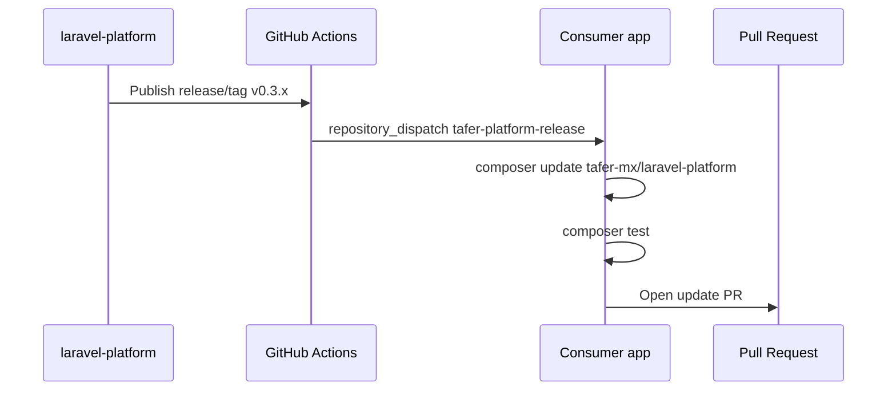

# Auto-updates del paquete en proyectos consumidores

Este flujo permite que cada release de `tafer-mx/laravel-platform` abra PRs
automáticos en las apps Laravel consumidoras.

## Flujo recomendado



El paquete no hace push directo a las apps. Cada app recibe el evento, actualiza
su lockfile, corre sus checks y abre un PR revisable.

## Secret requerido en el paquete

Agregar este secret en `tafer-mx/laravel-platform`:

```txt
TAFER_PROJECTS_DISPATCH_TOKEN
```

El token debe poder enviar `repository_dispatch` a los repos consumidores. Si se
usa un PAT fine-grained, necesita acceso a cada repo consumidor y permisos de
`Contents: read and write` o el permiso equivalente que permita crear dispatch
events.

## Repos consumidores

La lista inicial vive en `.github/workflows/dispatch-consumer-updates.yml`:

```yaml
env:
  CONSUMER_REPOS: |
    tafer-mx/villa-palmar-cancun
    tafer-mx/hotel-mousai
```

Agregar una nueva app consiste en sumar su repo a esa lista y configurar el
workflow receptor en la app.

## Workflow receptor para cada app

Cada proyecto Laravel consumidor debe tener un workflow similar:

```yaml
name: Update TAFER Platform Package

on:
  repository_dispatch:
    types: [tafer-platform-release]

jobs:
  update-package:
    runs-on: ubuntu-latest

    steps:
      - uses: actions/checkout@v4

      - uses: shivammathur/setup-php@v2
        with:
          php-version: '8.3'
          tools: composer
          coverage: none

      - name: Configure Composer auth
        run: composer config --global github-oauth.github.com "${{ secrets.TAFER_PACKAGES_TOKEN }}"

      - name: Check package is already installed
        id: package
        run: |
          if composer show --locked tafer-mx/laravel-platform > /dev/null 2>&1; then
            echo "installed=true" >> "$GITHUB_OUTPUT"
          else
            echo "::notice::tafer-mx/laravel-platform is not installed in this project. Skipping update."
            echo "installed=false" >> "$GITHUB_OUTPUT"
          fi

      - name: Update package
        if: steps.package.outputs.installed == 'true'
        run: composer update tafer-mx/laravel-platform --with-dependencies --no-interaction --no-progress

      - name: Run tests
        if: steps.package.outputs.installed == 'true'
        run: composer test

      - name: Create Pull Request
        if: steps.package.outputs.installed == 'true'
        uses: peter-evans/create-pull-request@v6
        with:
          branch: chore/update-tafer-platform
          title: "chore: update TAFER platform to ${{ github.event.client_payload.version }}"
          commit-message: "chore: update TAFER platform to ${{ github.event.client_payload.version }}"
          body: |
            Automated update for `tafer-mx/laravel-platform`.

            Version: `${{ github.event.client_payload.version }}`
```

Este template no instala el paquete si la app todavía no lo consume. Si
`tafer-mx/laravel-platform` no existe en `composer.lock`, el workflow termina sin
abrir PR.

La branch del PR es fija:

```txt
chore/update-tafer-platform
```

Si se publica `v0.3.1` y luego `v0.3.2` antes de mergear el PR anterior, el
siguiente workflow reutiliza la misma branch/PR y lo actualiza hacia la versión
más reciente compatible con el constraint de Composer.

## Composer auth en apps privadas

Si la app necesita autenticar Composer contra GitHub, agregar este secret en cada
repo consumidor:

```txt
TAFER_PACKAGES_TOKEN
```

El token debe poder leer `tafer-mx/laravel-platform`.

Las apps deben tener el repositorio VCS configurado:

```json
{
  "repositories": [
    {
      "type": "vcs",
      "url": "https://github.com/tafer-mx/laravel-platform"
    }
  ],
  "require": {
    "tafer-mx/laravel-platform": "^0.3"
  }
}
```

## Validación manual

Para probar el flujo:

1. Publicar un release/tag patch, por ejemplo `v0.3.1`.
2. Confirmar que corre `Dispatch Consumer Package Updates` en el paquete.
3. Confirmar que la app recibe `repository_dispatch`.
4. Confirmar que el PR automático solo actualiza `composer.lock` y, si aplica,
   `composer.json`.
