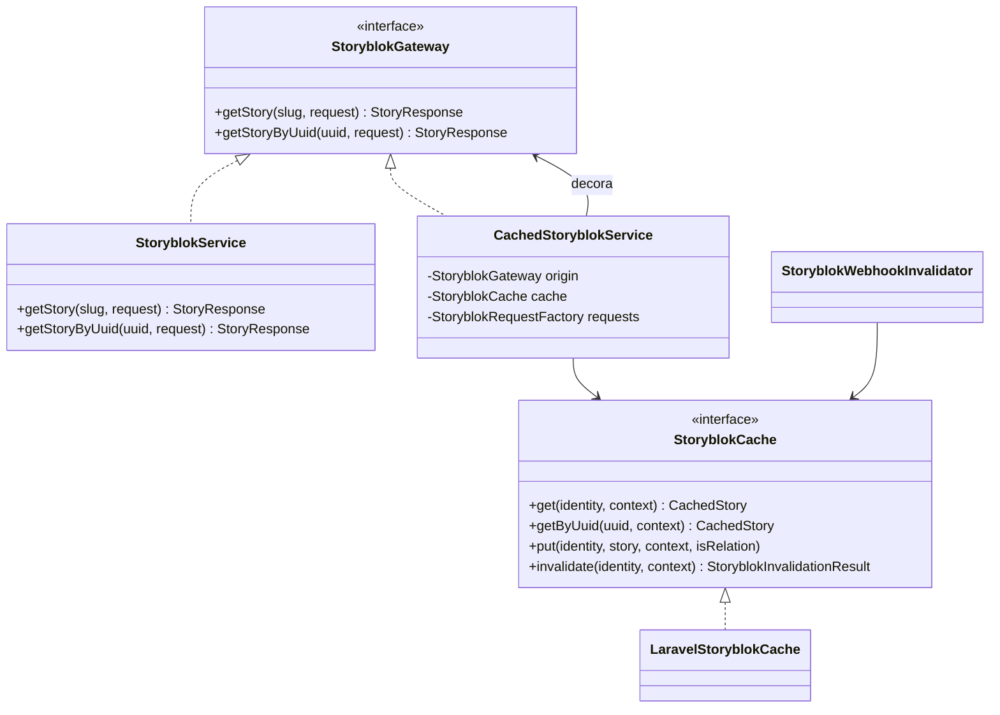
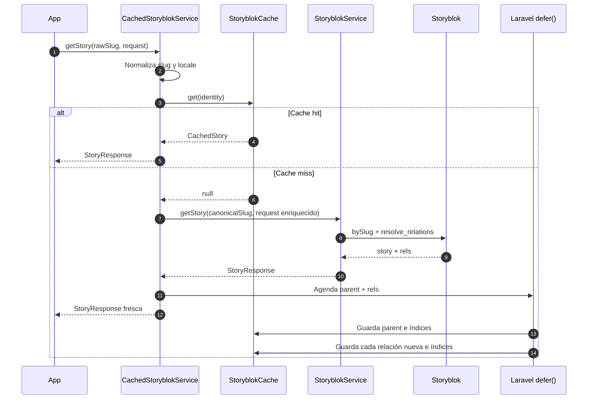
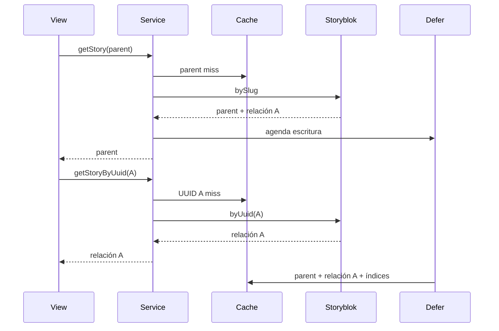
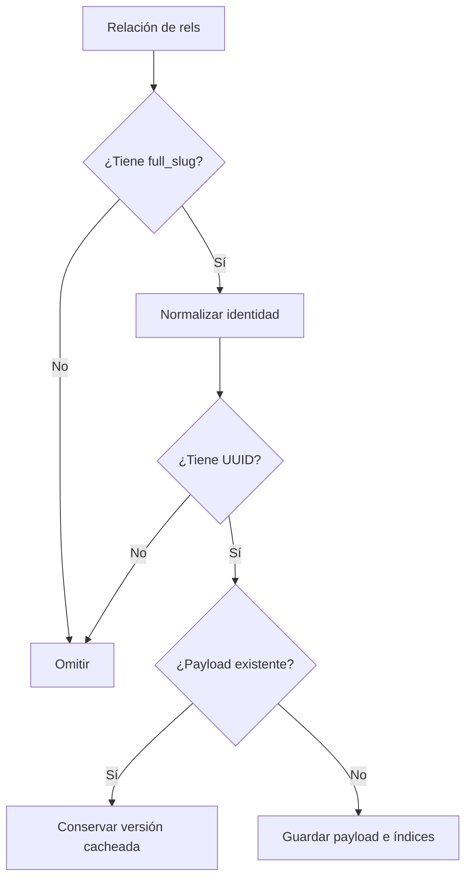
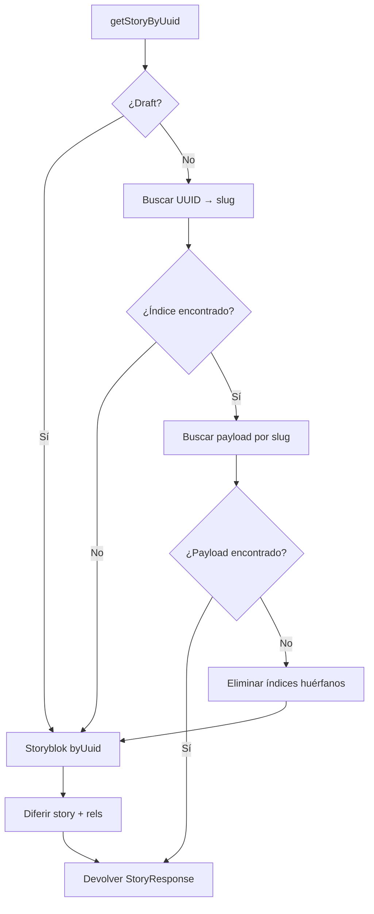

# Caché reutilizable de Storyblok

Esta capa replica en el paquete el flujo usado por las aplicaciones TAFER:

- cachea stories publicadas por slug y locale;
- guarda cada elemento de `StoryResponse::$rels` como una story independiente;
- resuelve stories y relaciones mediante UUID;
- difiere las escrituras hasta que termina correctamente la respuesta HTTP;
- nunca lee ni escribe caché para contenido draft;
- considera al webhook de cada story como la autoridad de invalidación;
- reutiliza los enums `Locale`, `Resort` y `Location` del paquete.

La configuración predeterminada vive en el paquete. Cada aplicación puede publicarla y
sobrescribirla mediante su propio `config/tafer.php` y `.env`.

## Arquitectura



### Responsabilidades

| Componente | Responsabilidad |
|---|---|
| `StoryblokService` | Ejecutar `bySlug()` y `byUuid()` sin conocer el caché. |
| `CachedStoryblokService` | Coordinar hits, misses, draft y escritura de `rels`. |
| `StoryblokRequestFactory` | Agregar locale, versión, `resolve_links` y `resolve_relations`. |
| `StoryblokIdentity` | Representar slug canónico, `Locale` y UUID opcional. |
| `LaravelStoryblokCache` | Guardar payload e índices bidireccionales en Laravel Cache. |
| `StoryblokWebhookInvalidator` | Convertir un webhook en una invalidación publicada. |
| `RequestCtx::storyblokSlug()` | Traducir la petición actual al path interno usado por Storyblok. |

## Identidad y normalización

El repositorio no recibe slugs sin normalizar. Toda operación usa `StoryblokIdentity`:

```php
final readonly class StoryblokIdentity
{
    public function __construct(
        public string $canonicalSlug,
        public Locale $locale,
        public ?string $uuid = null,
    ) {}
}
```

Ejemplo:

```text
full_slug recibido: es/brands/mousai/puerto-vallarta/suites
slug canónico:       brands/mousai/puerto-vallarta/suites
locale:              Locale::Spanish
```

El locale forma parte de la identidad aunque el UUID y el slug base coincidan.

## Construcción del path desde `RequestCtx`

Las aplicaciones no necesitan repetir la estructura interna de Storyblok en cada
controller. El middleware resuelve `RequestCtx` una sola vez y `storyblokSlug()`
traduce esa petición al path CMS:

```php
$slug = $requestCtx->storyblokSlug();

// brands/mousai/puerto-vallarta/suites
```

El caché no interpreta marcas ni destinos. Recibe el path final y usa `Locale`
para normalizarlo.

## Configuración

Publicar la configuración en cada aplicación:

```bash
php artisan vendor:publish --tag=tafer-config
```

Variables principales:

```dotenv
STORYBLOK_CACHE_ENABLED=true
STORYBLOK_CACHE_STORE=database
STORYBLOK_CACHE_STORY_TTL=0
STORYBLOK_CACHE_RELATION_TTL=0
STORYBLOK_CACHE_PREFIX=tafer:storyblok
STORYBLOK_CACHE_NAMESPACE=mousai
STORYBLOK_DEFAULT_LOCALE=en
STORYBLOK_RESOLVE_LINKS=url
```

Un TTL igual a `0` significa `forever`, reproduciendo el comportamiento actual. Cada app
debe usar un namespace diferente si comparte el mismo cache store con otros sitios o
espacios de Storyblok.

Los campos de relaciones se configuran en:

```php
'storyblok' => [
    'resolve_relations' => [
        'Basic_reference.reference',
        'Element_references.Content_info_pages',
        // ...
    ],
],
```

Cada aplicación puede reemplazar esta lista en su `config/tafer.php`.

## Uso desde las aplicaciones

Los controladores y componentes deben depender de `StoryblokGateway`:

```php
use TAFER\Core\Contracts\StoryblokGateway;

final class PageController
{
    public function __construct(
        private StoryblokGateway $storyblok,
    ) {}

    public function show(): array
    {
        $response = $this->storyblok->getStory(
            'brands/mousai/puerto-vallarta/suites',
            new StoryRequest(language: Locale::Spanish->value),
        );

        return $response->story;
    }
}
```

Cuando `STORYBLOK_CACHE_ENABLED=false`, el contrato resuelve `StoryblokService`. Cuando
está habilitado, resuelve `CachedStoryblokService`.

Inyectar directamente `StoryblokService` omite el decorador y, por tanto, el caché.

## Integración con RequestCtx

Las aplicaciones que concentran todas sus páginas en un controlador pueden registrar
`ResolveRequestCtx` en la ruta catch-all. El middleware resuelve una sola vez:

- `Resort` desde `TAFER_BRAND_SLUG`;
- `Locale` desde el primer segmento `en` o `es`;
- `Location` desde los segmentos públicos;
- slug público sin locale;
- preview mediante `_storyblok`;
- dispositivo.

El controlador no reconstruye estos datos:

```php
final readonly class PageController
{
    public function __construct(
        private StoryblokGateway $storyblok,
        private StoryblokRequestFactory $requests,
    ) {}

    public function __invoke(RequestCtx $context): JsonResponse
    {
        $response = $this->storyblok->getStory(
            $context->storyblokSlug(),
            $context->storyblokRequest($this->requests),
        );

        return response()->json($response->story);
    }
}
```

Ejemplos de traducción:

```text
Resort:     villa-palmar-cancun
URL:        /home-villa-palmar-cancun
Storyblok:  brands/villa-palmar-cancun/home-villa-palmar-cancun

Resort:     villa-palmar-cancun
URL:        /
Storyblok:  brands/villa-palmar-cancun/home-villa-palmar-cancun

Resort:     garza-blanca
URL:        /puerto-vallarta
Storyblok:  brands/garza-blanca/puerto-vallarta/home-puerto-vallarta

Resort:     mousai
URL:        /es/puerto-vallarta/suites
Storyblok:  brands/mousai/puerto-vallarta/suites
Locale:     es
```

`storyblokSlug()` omite la ubicación sintética `corp` y evita duplicar la ubicación
cuando ya aparece en el slug público. Para rutas raíz aplica el prefijo `home-*`
que Storyblok usa para los homes de marca o destino.

## Flujo de lectura por slug



La escritura usa el nombre:

```text
storyblok-cache:{namespace}:{locale}:{canonicalSlug}
```

Laravel deduplica callbacks con el mismo nombre.

## Primera visita y escrituras diferidas

El paquete conserva deliberadamente el comportamiento actual:

1. Storyblok devuelve la parent y sus `rels`.
2. La parent se entrega al render inmediatamente.
3. Parent y relaciones todavía no existen en Laravel Cache.
4. Si un componente llama `getStoryByUuid()` durante ese render, puede producir otra
   llamada a Storyblok.
5. Después de una respuesta HTTP exitosa, `defer()` guarda parent, relaciones e índices.



## Escritura de relaciones

Por cada elemento de `StoryResponse::$rels`:

1. Debe contener `full_slug`.
2. Debe contener un UUID.
3. Se normaliza usando el mismo locale de la parent.
4. Si el payload ya existe, no se reemplaza.
5. Si no existe, se guarda como relación para usar el TTL configurado de relaciones.



El webhook de la relación, no la lectura de una parent, es la autoridad que refresca ese
contenido.

En un cache hit, el paquete reconstruye `StoryResponse` con la story y sus links, pero con
`rels` vacío. Las relaciones ya viven como entradas independientes y deben resolverse con
`getStoryByUuid()`, igual que en las aplicaciones actuales.

## Estructura de claves

Las claves incluyen namespace, versión y locale. El identificador se hashea para ser
compatible con todos los drivers de Laravel:

```text
{prefix}:{namespace}:{version}:{locale}:story:{sha256(slug)}
{prefix}:{namespace}:{version}:{locale}:uuid:{sha256(uuid)}
{prefix}:{namespace}:{version}:{locale}:slug-uuid:{sha256(slug)}
```

Los valores son:

```text
story key     -> CachedStory serializado como array
uuid key      -> canonicalSlug
slug-uuid key -> UUID
```

El índice bidireccional permite eliminar todas las claves aunque el payload haya
desaparecido.

Si un índice UUID apunta a un payload inexistente, `getByUuid()` elimina inmediatamente
los índices huérfanos y devuelve cache miss.

## Flujo por UUID



## Draft y preview

Una petición con `Version::Draft`:

- no consulta Laravel Cache;
- no programa callbacks diferidos;
- no modifica entradas publicadas;
- sí conserva `resolve_links` y `resolve_relations`.

No existe una opción para cachear drafts.

## Webhooks

El paquete incluye un controller reutilizable para que todas las apps compartan
la misma traducción del payload de Storyblok a invalidación de caché. La app host
solo registra la ruta y decide su URL pública.

```php
use Illuminate\Support\Facades\Route;
use TAFER\Core\Http\Controllers\StoryblokWebhookController;

Route::post('/storyblok/webhook', StoryblokWebhookController::class);
```

Como Storyblok hace el `POST` desde fuera de la sesión Laravel, esa ruta debe
quedar fuera de CSRF en la app host.

El controller entiende el payload estándar de Storyblok:

```json
{
  "text": "The user published the Story config_brand_puerto-vallarta (...)",
  "action": "published",
  "space_id": 285826016720786,
  "story_id": 87702217043285,
  "full_slug": "brands/garza-blanca/puerto-vallarta/config_brand_puerto-vallarta",
  "full_slug__i18n__es": "es/brands/garza-blanca/puerto-vallarta/config_brand_puerto-vallarta"
}
```

Si llega `full_slug__i18n__es`, invalida `en` y `es`. Si no llega, resuelve el
locale desde `full_slug`.

`StoryblokInvalidationResult` diferencia:

- si existía y se eliminó el payload;
- si existía y se eliminó el índice UUID→slug;
- si existía y se eliminó el índice slug→UUID;
- si el estado final es exitoso.

Esto evita reportar `false` cuando el payload fue eliminado pero un índice ya estaba
ausente.

## Invariante de las parents

Una parent cacheada conserva UUIDs, no relaciones expandidas utilizadas directamente.
Los componentes deben resolver esas referencias mediante `getStoryByUuid()`.

Por ello, publicar una relación sigue este flujo:

```text
webhook de relación
    -> elimina relación e índices
    -> parent permanece cacheada con el UUID
    -> siguiente render llama getStoryByUuid()
    -> cache miss
    -> Storyblok devuelve la relación actualizada
```

Si una aplicación guarda y utiliza relaciones expandidas dentro de la parent, deberá
añadir invalidación de dependencias parent↔relación; ese comportamiento no forma parte de
esta estrategia.

## Cobertura de pruebas

La suite verifica:

- escritura diferida y deduplicación;
- cache de parent por slug;
- cache independiente de `rels`;
- resolución posterior por UUID sin llamar a Storyblok;
- conservación de relaciones ya cacheadas;
- aislamiento por `Locale`;
- bypass de draft;
- limpieza de índices huérfanos;
- invalidación bidireccional;
- invalidación en inglés y español;
- construcción de paths con `Resort` y `Location`.
